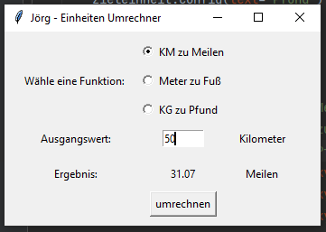

# 027-units-converter
100 Days of Code - Day 27: Units Converter

Learned:
- Introduction Tkinter
- Creating windows and labels
- Default values for optional arguments
- args/ kwargs
- Radiobuttons, scales, checkbuttons and more
- pack(), place(), grid()
